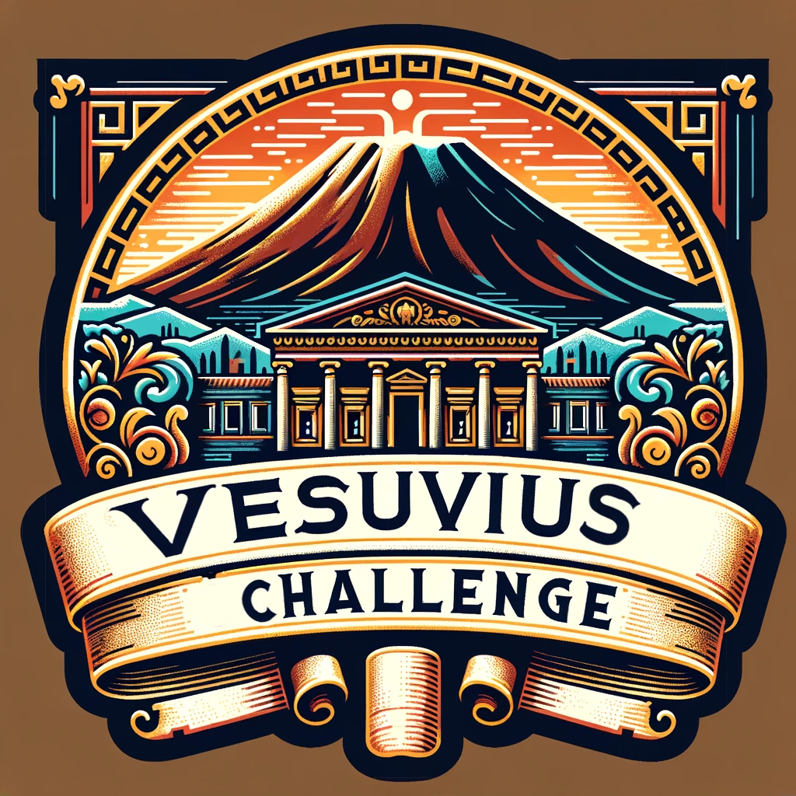

# Vesuvius Grandprize Winning Solution

The Repository contains the First Place Vesuvius Grand Prize solution. 


# Solution:
Our final canconical model was a timesformer small architecture with divided space-time attention. 
The dataset underwent expansion and cleaning rounds to increase accuracy of the labels and become as accurate as possible, approximately 15 rounds were performed between the first letters and final solution. 
Our solution also consisted of 2 other architectures, Resnet3D-101 with pretrained weights, I3D with non-local block and maxpooling. 

Our implementation uses `torch`, `torch-lightning`,the [`timesformer-pytorch`](https://github.com/lucidrains/TimeSformer-pytorch) and [`3D-ResNets-PyTorch`](https://github.com/kenshohara/3D-ResNets-PyTorch/blob/master/models/resnet.py). 


# 🚀 Get Started


To install this project, run:

```bash
pip install -r requirements
#to download the segments from the server
./download.sh
#propagates the inklabels into the respective segment folders for training
python prepare.py
```


